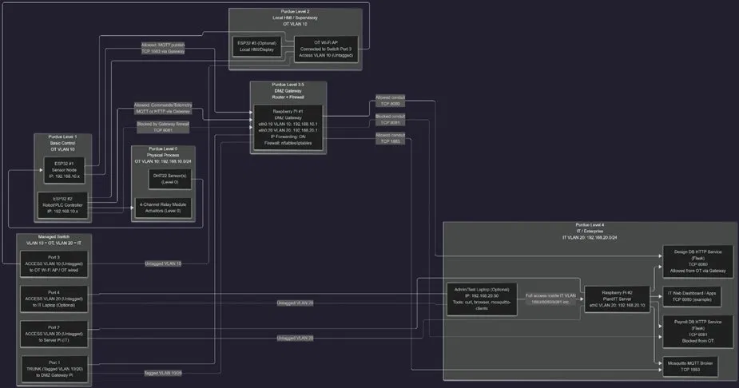
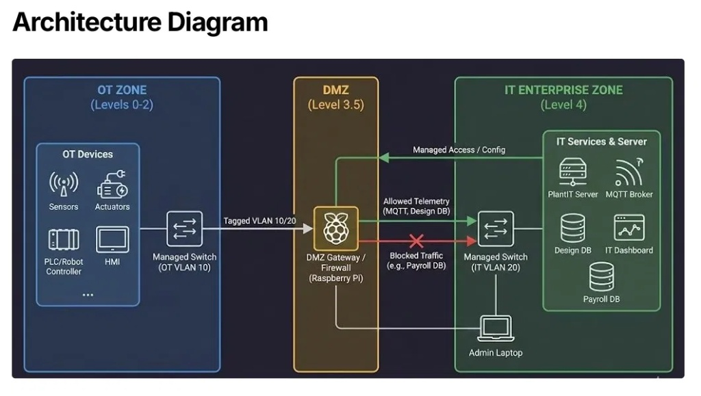
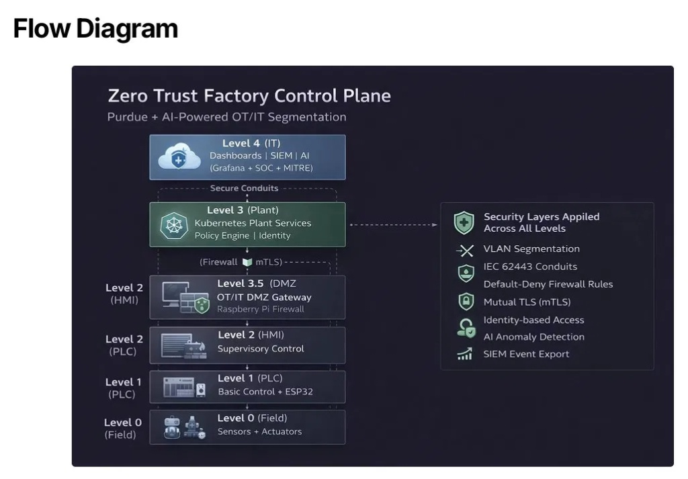

# Zero Trust Factory Control Plane (ZTFCP)

> **Purdue + AI-Powered OT/IT Segmentation**

A next-generation cybersecurity architecture for Industry 5.0 — combining Purdue-model zoning, micro-segmentation, certificate-based authentication, and AI-driven behavioral anomaly detection to protect modern factory environments.



[](https://www.iec.ch/cyber-security)
[](https://ec.europa.eu/info/research-and-innovation/research-area/industrial-research-and-innovation/industry-50_en)
[](https://www.nist.gov/publications/zero-trust-architecture)

---

## 🎯 Executive Summary

Modern factories are converging IT and OT networks at an unprecedented pace. Legacy Purdue-model environments were designed for isolation — not the hyper-connected, data-driven demands of Industry 5.0. This creates critical attack surfaces: unencrypted device communications, flat OT network topologies, and a lack of behavioral baselining for anomalous activity.

**A single lateral movement event in an OT environment can cascade from a sensor node to a plant-wide operational shutdown.** This project delivers a deployable, hardware-backed solution that enforces Zero Trust identity verification and sub-second AI threat response natively at the edge. It effectively neutralizes unauthorized access, spoofing, and physical anomalies before critical thresholds are breached.

---

## 🏗️ Architecture Overview

The physical network is strictly segmented according to the **Purdue Enterprise Reference Architecture**. All OT and IT routing passes through a heavily controlled ICS network configuration using Windows Internet Connection Sharing (ICS) and native network manager controls, ensuring traffic only flows between explicitly authorized subnets.

### System Architecture
*(The hardware and network boundaries defining the factory control plane)*



### Data & Security Flow
*(The end-to-end pipeline from physical sensors to the SIEM/AI layer)*



### Purdue Level Mapping & Hardware

| Purdue Level | Zone | Components | Security Controls |
| :--- | :--- | :--- | :--- |
| **Level 4** | IT Enterprise | ASUS ROG Laptop (`192.168.137.1` / `10.130.190.53`) | Subnet isolation; Phase 1 software plant simulation; SIEM event ingestion; role-based Grafana SOC access. |
| **Level 3.5** | DMZ Gateway | Seeed reComputer J1010 (Jetson Nano - `192.168.137.200`) | Uncomplicated Firewall (UFW) enforcement; default-deny policy; secure mTLS termination point. |
| **Level 3** | Operations | Jetson Nano Core Services | Mosquitto broker (mTLS on 8883); Isolation Forest AI engine; Prometheus metrics collection; Grafana dashboard. |
| **Level 1–2** | Basic Control | ESP32 Microcontrollers (`10.130.190.x`) | Micro-segmented MQTT topics; cryptographic mTLS identity profile. |
| **Level 0** | Field/Edge | DHT22 Sensors & SG90 Servo Actuator | Physical environmental monitoring and autonomous safety response actuation. |

---

## 🛡️ Security Features (OT/IT Convergence)

### 1. Mutual TLS (mTLS) & Zero Trust Identity
Every connection inside the factory control plane requires Mutual TLS (mTLS). Both the client (ESP32) and the server (Jetson Nano) must present valid, CA-signed X.509 certificates. Unauthenticated connections, even from within the local network range, are instantly dropped at the socket layer. To ensure resilience in offline, air-gapped environments lacking Network Time Protocol (NTP) access, a custom epoch-time anchoring routine is programmed directly into the microcontroller firmware to prevent false mTLS certificate expiration failures.

### 2. ACL Micro-Segmentation
Mosquitto Access Control Lists (ACLs) prevent unauthorized lateral movement inside the message broker layer. Sensor nodes (`esp32-1`, `esp32-2`) are cryptographically restricted to publish strictly to their designated telemetry topics and are explicitly denied privileges to write or subscribe to actuator command topics, effectively isolating compromised edge units.

### 3. Predictive AI Security Layer
An unsupervised **Isolation Forest** machine learning model runs natively on the Jetson Nano's 128-core Maxwell GPU.
* **Behavioral Baselining:** The system continuously evaluates incoming environmental telemetry (`t1`, `h1`, `t2`, `h2`) against a mathematical baseline established during normal operation.
* **Predictive Horizon:** A sliding window tracker calculates the real-time Rate of Change (`dT/dt`) of temperature and humidity parameters to forecast critical boundary breaches *before* they occur.
* **Autonomous Response:** If a high or critical anomaly severity index is computed (Score $\ge$ 0.85), the detector bypasses human intervention and autonomously issues an immediate `OPEN` instruction to the physical SG90 safety servo actuator over the mTLS-secured command channel to dump pressure/heat in under 1 second.

### 4. SOC-Ready Visibility & MITRE ICS Mapping
All anomalous events are automatically enriched with **MITRE ATT&CK for ICS** framework technique identifiers (such as *T0814 Denial of Control* and *T0856 Spoof Reporting Message*). Security event telemetry is written to persistent local alert logs (`/data/siem/events/alerts.json`) formatted in standard CEF/Syslog parameters for direct downstream forwarding to enterprise SIEM tools.

---

## 🚀 Live SOC Stack (Observability)

* **Message Bus:** Eclipse Mosquitto 2.0.18 (Compiled from source for aarch64 on JetPack 4.6.1).
* **Metrics Aggregation:** Prometheus 2.45.0 scraping a custom Python MQTT exporter interface on port `8000` and hardware infrastructure metrics via `node_exporter` on port `9100`.
* **HMI Dashboard:** Grafana 12.4.1 streaming live anomaly scores, rate-of-change trendlines, prediction horizons, and gateway system performance metrics.

---

## 📂 Repository Structure

```text
Zero-Trust-Factory/
│
├── Physical_Hardware_Implementation/
│   ├── edge_nodes/               # ESP32 C++ firmware files (DHT22 Sensors & SG90 Servo)
│   ├── ai_security_layer/        # Isolation Forest detector, training scripts, & baseline data
│   ├── siem_pipeline/            # Prometheus MQTT exporter, node_exporter config, & Grafana JSON
│   ├── mosquitto_config/         # Zero Trust ACL security files and mTLS configurations
│   └── scripts/                  # Shell scripts for automated startup & health checks
│
├── Zero-Trust-Factory_Simulation/# Phase 1: Kubernetes software plant simulation (Calico CNI policies)
│
├── References/                   # Threat modeling, SPPU Project Reports, and IEC 62443 docs
│
├── images/                       # Topologies, system architecture, and data flow diagrams
│
├── LICENSE                       # Open-source distribution license
└── README.md                     # Master Documentation (This File)
🚦 Getting Started
1. Start the Background Services
Execute the consolidated startup script on the Jetson Nano to spin up the broker, SIEM components, and the AI evaluation engine:

Bash
./Physical_Hardware_Implementation/scripts/start_ztfcp.sh
2. Verify Infrastructure Health
The startup routine runs an automated port and socket readiness check across all critical interfaces:

1883 - Localhost Wiretap (Unencrypted internal connection)

8883 - MQTTS (mTLS Enforced perimeter)

3000 - Grafana SOC HMI Dashboard

9090 - Prometheus TSDB Engine

8000 - Python MQTT Exporter Metric Endpoint

3. Access the Monitoring Interface
Open a secure browser instance on an authorized administrator machine within the network and connect to the Grafana panel at http://192.168.137.200:3000 using the configured access credentials (admin / admin123).

🗺️ Roadmap & Future Scope
Aligned with our long-term research goals and the cybersecurity alignment strategies defined by IEC 62443 industrial guidelines, subsequent implementation phases include:

Expand Physical Lab Coverage: Introduce additional edge controller configurations and integrate brownfield PLC instrumentation over legacy serial connections.

Harden AI Processing Blocks: Train the unsupervised Isolation Forest models against advanced temporal sequences using deep learning LSTM Autoencoders exposed to explicit ICS attack vectors, including replay and targeted telemetry spoofing scenarios.

Production Pilot Deployment: Transition from an isolated testing network to a live production environment through an integrated Security Operations Center (SOC) pilot loop leveraging active Wazuh SIEM threat hunting utilities.

Compliance Audit Readiness: Complete formal technical evaluation profiles to certify the control plane architecture against international IEC 62443 Security Level 2 (SL-2) requirements.

🏆 Project Team
Developed as a Final Year Engineering Capstone Project under the academic guidance of Prof. Amol Suryawanshi.

Shambhavi Raj (22311465)

Shardul Bangale (22311187)

Shravya Bhandary (22310645)

Arya Kuwar (22311452)

BRACT's Vishwakarma Institute of Information Technology (VIIT Pune) — Department of Computer Science Engineering with Specialization in IoT, Cybersecurity, and Blockchain Technology, AY 2025-26.
